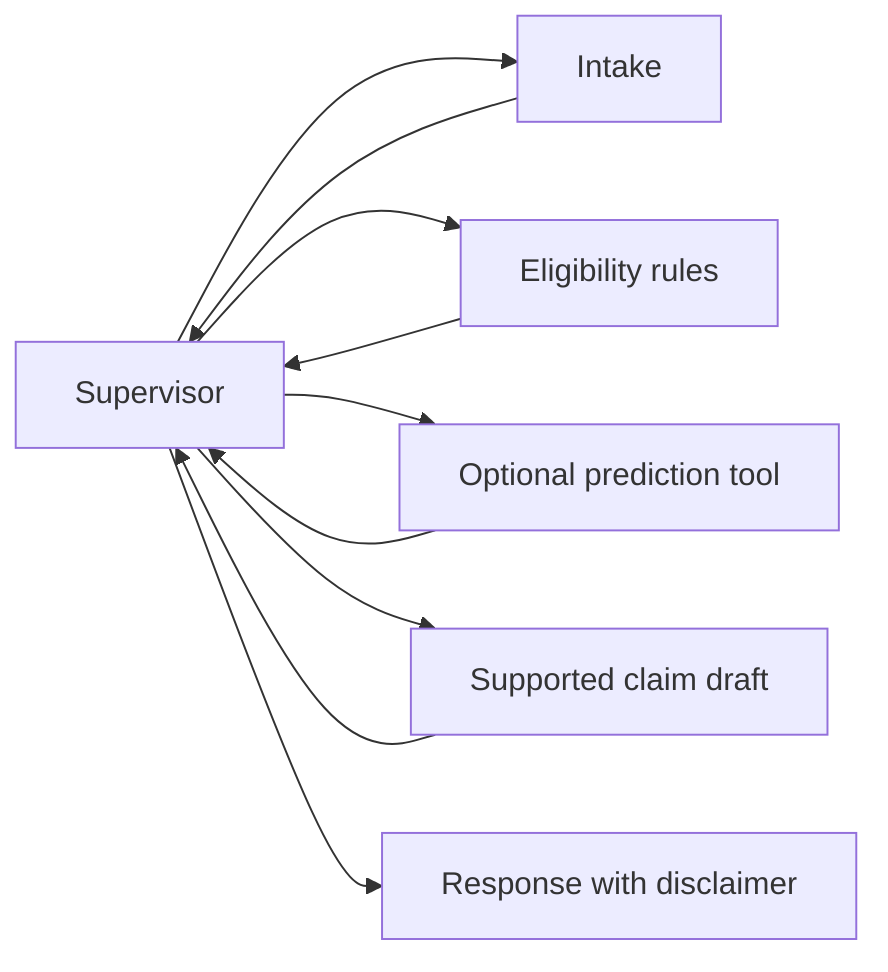

# ✈️ Flight Disruption Copilot

A multi-agent AI system that helps air passengers understand their compensation
rights when flights are delayed, cancelled, or they're denied boarding.

> **⚠️ Disclaimer:** This is a learning project. It provides informational
> analysis only and does **not** constitute legal advice. Always consult a
> legal professional for your specific situation.

## What it does

**Current implementation:** phases 1–6 are implemented: data models, rules,
real BTS model training, the LangGraph workflow, API/UI, and five-scenario evaluation.
Use the local Streamlit interface, FastAPI service, Python interface, or terminal.

1. **Describe your disruption** — in plain language or via a structured form
2. **Get a compensation assessment** — the system checks EU261 (Europe) and
   US DOT rules using a deterministic rules engine (not LLM guesswork)
3. **Receive a draft claim letter** — review and fill placeholders before sending
4. **See delay risk predictions** — an ML model estimates how likely your
   route is to experience delays

## Architecture

```
┌──────────────────────────────────────────────────────────────┐
│                     Supervisor Agent                         │
│                  (routes between specialists)                │
└───────┬──────────────┬──────────────┬──────────────┬─────────┘
        │              │              │              │
   ┌────▼────┐   ┌─────▼─────┐  ┌────▼────┐  ┌─────▼─────┐
   │ Intake  │   │Eligibility│  │  Delay  │  │  Claim    │
   │ Agent   │   │  Agent    │  │Predictor│  │  Drafter  │
   │         │   │           │  │  (ML)   │  │           │
   │ Text →  │   │ Rules     │  │         │  │ Facts →   │
   │ Struct  │   │ Engine    │  │ Model   │  │ Letter    │
   └─────────┘   └─────┬─────┘  └─────────┘  └───────────┘
                        │
                  ┌─────▼─────┐
                  │ EU261/DOT │  ← Deterministic Python rules
                  │ Rules     │    with unit tests
                  └───────────┘
```

### Key design decisions

- **Rules are deterministic, not LLM-driven.** EU261 and DOT compensation
  rules have specific conditions. The LLM extracts facts; plain Python applies
  the rules and produces their explanations. Missing facts become questions.
- **Multi-agent over monolithic chain.** Each agent is focused and testable.
- **LLM provider is configurable.** Switch between OpenAI and Google Gemini
  via environment variables.

## Setup

```bash
# Clone the repo
git clone https://github.com/Kartik-loop/flight-disruption-copilot.git
cd flight-disruption-copilot

# Create a virtual environment and install dependencies
uv venv
source .venv/bin/activate      # On macOS/Linux
uv pip install -e ".[all]"     # Install all dependencies

# Copy environment template and add your keys
cp .env.example .env
# Edit .env with your API key(s)

# Run tests
pytest
```

## Phase 5: run the local interface

In two terminals, from the project root with the environment activated:

```bash
# Terminal 1: assessment service
uvicorn copilot.api.main:app --host 127.0.0.1 --port 8000
# Terminal 2: passenger interface
streamlit run ui/app.py --server.address 127.0.0.1 --server.port 8501
```

Open [the interface](http://127.0.0.1:8501) or [API documentation](http://127.0.0.1:8000/docs).
The form works without an LLM key. Plain-language input needs a configured provider
and sends the description to that provider. Do not include booking references or
identity documents. Results live in browser-session memory, with no application
history database; drafts download locally and are never sent automatically.

`GET /health` checks the process, not provider credentials or model readiness.
`POST /assess` accepts a `CopilotRequest` (exactly one of `text` or `disruption`)
and returns `CopilotResponse`. Missing facts and manual-review statuses use HTTP
200; malformed requests use 422, unexpected server failures 500. Failures include
a disclaimer and omit raw inputs and exception details.

Choose **Edit facts / answer questions** to prefill the structured form after an
assessment. Unknown answers stay unknown. Predictions need a trained model and
scheduled local departure time; synthetic predictions require explicit opt-in
and are labelled. Prediction failure does not discard the passenger-rights result.

The UI defaults to `http://127.0.0.1:8000`. To change it, export
`COPILOT_API_URL` in the UI process environment before launching Streamlit.
This is a local learning demo without authentication or rate limits; public
hosting is outside this phase. The client makes one request with a 90-second
timeout and does not automatically retry paid provider calls.

## Phase 3: train the delay model

No LLM key is needed. From the project root, activate the virtual environment
and install the ML and test dependencies:

```bash
uv pip install -e ".[ml,dev]"
python -m copilot.ml.data --year 2025 --months 1 2 3 --rows-per-month 20000
python -m copilot.ml.train --data data/processed/bts_sample.csv
pytest
```

The downloader caches three official [BTS monthly archives](https://transtats.bts.gov/PREZIP/)
(roughly 85 MB compressed in total), reads them in chunks, and randomly samples
20,000 usable flights per month. It samples across each complete archive rather
than taking its first rows. Re-running uses the cached downloads. Use `--data-dir`
and training's `--output-dir` to choose different locations; their defaults also
respect `DATA_DIR` and `MODELS_DIR` environment settings.

If BTS cannot be reached, the command fails clearly. To explicitly allow labelled
synthetic teaching data instead:

```bash
python -m copilot.ml.data --year 2025 --months 1 2 3 --allow-synthetic
# Only if the downloader reports source=synthetic:
python -m copilot.ml.train --data data/processed/synthetic_sample.csv
```

The fallback replaces the whole sample; real and synthetic rows are never mixed.
Synthetic scores demonstrate the pipeline, **not real-world predictive quality**.
Source labels are carried into dataset metadata, model metadata, and the report.

The target is arrival delay of **15 minutes or more**, using BTS `ArrDelay`.
Cancelled, diverted, and missing-outcome records are excluded, so the model
estimates delay among completed, non-diverted US domestic flights. Inputs are
airline, origin, destination, scheduled local departure hour, weekday, and month.
Actual departure delay, arrival times, and reported delay causes are excluded.
See the [official BTS field definitions](https://transtats.bts.gov/Fields.asp?gnoyr_VQ=FGJ).

January and February train the model; March is held out. Preprocessing is fitted
only on training rows. Training saves:

- `models/delay_model.joblib`: fitted encoder and LightGBM classifier together.
- `models/model_metadata.json`: source provenance, file hashes, features, library
  versions, training date, time split, and evaluation metrics.
- `models/evaluation.md`: monthly exploration and accuracy, precision, recall,
  and ROC-AUC compared with an always-on-time baseline.

The classification threshold is fixed at 0.5. Model probabilities are not yet
calibrated; performance from one season does not establish year-round quality.
The prediction tool and agent integration are implemented in phase 4. Only load trusted
joblib files, since loading them can execute Python code.

**Current saved model: REAL BTS DATA.** On September 27, 2026, the March retry
succeeded. January–March 2025 contribute 20,000 flights each: 40,000 training
rows and 20,000 held-out March rows. `models/model_metadata.json` records
`source: "real"`, `data_source: "bts"`, `data_manifest.synthetic: false`, and
all three official archive URLs/hashes. The earlier synthetic model was replaced;
old synthetic CSVs remain separately labelled and are not used by this model.
The API's `/model-status` and the UI's prominent banner show the active source.

The [current evaluation](models/evaluation.md) reports accuracy **80.22%** versus
**80.295%** for always predicting on time, precision **43.59%**, recall **1.29%**,
and ROC-AUC **0.6187**. At the fixed 0.5 threshold the model misses almost all
delays and slightly underperforms baseline accuracy. This is a real historical
sample evaluation, **not a production-ready or calibrated forecast**. The held-out
month was not used to tune the threshold; future tuning needs separate validation.

## Phase 4: run the LangGraph workflow

```bash
uv pip install -e ".[agents,ml,dev]"

# Fully offline: rules and draft letter from a structured form
python -m copilot.graph --file examples/eu_delay.json

# Real BTS model: no synthetic opt-in needed
python -m copilot.graph --file examples/us_denied_boarding.json --predict

# Calls the configured LLM; requires a valid provider key and available model
python -m copilot.graph --text "LH flew FRA to CDG on 2025-03-10. I arrived 4 hours late because of a technical fault."
```

Use `--no-letter` to skip drafting. With `--predict` alone, a synthetic model
returns an availability warning rather than a misleading forecast. Prediction
requires a scheduled departure-airport **local time**, a US domestic route, and
airline/airport categories present in the training sample. Full airline names
are not silently mapped to IATA codes.

The Python entry point is `run_copilot(CopilotRequest(...))` in
`copilot.graph.workflow`. Exactly one of `text` or `disruption` is required.
Each call starts fresh; supply corrected facts in a new request after answering
follow-up questions. There is no persistent conversation store in this phase.



Only free-text intake uses an LLM. The other specialists are deterministic
nodes: predictable routing, auditable legal reasoning, a local model tool,
and a factual letter template. This keeps numerical claims grounded in the
rules result and makes the form workflow work without API keys. Letters are
never sent automatically, and unknown personal details remain placeholders.

Responses distinguish `complete`, `needs_information`, `review_required`, and
`error`. Cash eligibility can be `null` when unresolved; refund eligibility is
a separate field. EU and US assessments remain separate, and amounts are not
added together. Every outcome includes a disclaimer, including provider errors.

**Phase-4 checkpoint:** 106 tests passed, including the actual compiled graph, uncertainty
regressions, model loading, and provider configuration. Both provider adapters
construct successfully without sending a request. No API keys were configured,
so live LLM extraction quality and provider connectivity remain unverified.
Tests use controlled extractor responses, not pretend live-provider results.
The installed LangGraph dependency emits one pending-deprecation warning; no
checkpoint/persistence backend is enabled in this project.

Read [the phase-4 learning guide](LEARNING.md#phase-4-langgraph-specialists-and-safe-boundaries)
and the reproducible [examples](examples/README.md).

## Project structure

The API and UI use the same graph as the CLI. `reports/` contains the recorded
phase-6 HTTP requests and responses, including full letters.

```
flight-disruption-copilot/
├── README.md              ← You are here
├── LEARNING.md            ← Learning guide: concepts, reading order, exercises
├── pyproject.toml         ← Project config and dependencies
├── .env.example           ← Template for environment variables
│
├── src/copilot/
│   ├── schemas/           ← Pydantic data models (the shared language)
│   │   └── flight.py      ← FlightDisruption, CompensationResult, etc.
│   ├── config.py          ← Settings from environment variables
│   ├── rules/             ← Deterministic compensation rules
│   │   ├── eu261.py       ← EC 261/2004 regulation
│   │   ├── dot.py         ← US DOT rules
│   │   └── engine.py      ← Primary routing and separate multi-regime results
│   ├── ml/                ← Delay prediction ML model
│   │   ├── data.py        ← Data download and preparation
│   │   ├── train.py       ← Model training pipeline
│   │   └── predict.py     ← Guarded prediction tool for agents
│   ├── agents/            ← LangGraph agent implementations
│   │   ├── intake.py      ← Free text → structured FlightDisruption
│   │   ├── eligibility.py ← Runs rules engine, explains results
│   │   ├── drafter.py     ← Writes claim letters
│   │   └── supervisor.py  ← Routes between agents
│   ├── graph/             ← LangGraph workflow definition
│   │   └── workflow.py    ← State graph wiring
│   └── api/               ← FastAPI web API
│       └── main.py        ← API endpoints
│
├── ui/
│   └── app.py             ← Streamlit demo UI
│
├── data/                  ← Raw and processed data (gitignored)
├── models/                ← Ignored model binary; tracked metadata and evaluation
├── examples/              ← CLI samples and repeatable live API evaluation
├── reports/               ← Actual phase-6 API outputs and readable report
├── notebooks/             ← Optional EDA notebooks
└── tests/                 ← pytest test suite
    ├── test_schemas.py
    ├── test_config.py
    ├── test_eu261.py
    ├── test_dot.py
    └── ...
```

## Tech stack

| Component | Technology |
|-----------|-----------|
| Multi-agent system | LangGraph |
| Data validation | Pydantic v2 |
| Web API | FastAPI |
| Demo UI | Streamlit |
| ML model | scikit-learn + LightGBM |
| Training data | US BTS On-Time Performance |
| LLM providers | OpenAI GPT-4o / Google Gemini (configurable) |
| Testing | pytest |

## Phases

This project is built incrementally:

1. ✅ **Scaffold** — Project structure, config, schemas, README
2. ✅ **Rules engine** — Deterministic EU261/DOT rules with unit tests
3. ✅ **ML model** — BTS sampling, delay model training, and time-based evaluation
4. ✅ **Agents** — LangGraph workflow, guarded prediction, factual drafts, and clarification
5. ✅ **API + UI** — FastAPI endpoints and Streamlit demo
6. ✅ **Integration** — Five live API scenarios, error checks, real BTS retraining, final polish

## Phase 6: actual end-to-end evaluation

Start the API as above, then run:

```bash
python examples/evaluate_api.py
# Only when the running API has no LLM key configured:
python examples/evaluate_api.py --check-missing-key
pytest -q
ruff check .
```

The runner uses real local HTTP, not FastAPI TestClient or mocked agents. It
records exact inputs, validated facts, all rules reasoning, statuses, questions,
and full letters in [the readable report](reports/phase6_evaluation.md) and
[raw JSON](reports/phase6_api_results.json). Requests use the same structured
contract as the UI. **They do not verify live LLM extraction**: neither provider
key is configured. Controlled extractor unit tests and the missing-key check
are separate from that unverified capability.

| Live scenario | Observed response |
|---|---|
| FRA–JFK, 300-minute arrival delay, technical fault | `complete`, EUR 600, claim draft |
| JFK–LAX cancellation; passenger declines travel and credits | `complete`, refund eligible, no fixed cash award, refund draft |
| JFK–LAX involuntary oversales; $300 fare, alternative 150 minutes later | `complete`, USD 1,200 (400% tier), claim draft |
| FRA–CDG delay; arrival duration missing | `needs_information`, arrival-delay question, no amount or letter |
| FRA–CDG, exactly 180-minute arrival delay, technical fault | `complete`, EUR 250; the three-hour threshold is inclusive |

Additional live probes: malformed JSON → HTTP 422 with a safe error; unknown
`ZZZ` airport → manual review with no invented distance or letter; missing LLM
key → actionable error recommending Flight details; real saved-model prediction
→ `data_source: "bts"` without synthetic opt-in. All five scenarios and four
probes passed. The full test suite passes **127 tests**, and repository lint passes.
One upstream LangGraph pending-deprecation warning remains.

Restart both API and Streamlit after changing imported Python modules or provider
configuration; an already-running Streamlit process may retain old imports.

## Rules-engine corrections and remaining limits

Phase 4 corrected the previously reproduced gaps:

- Missing nationality, notice, boarding facts, fares, or alternative schedules
  produce questions, rather than assumed coverage or invented cash amounts.
- Cause matching uses word boundaries. Negated, mixed, and unfamiliar causes
  require review; reported weather alone is not a proven exemption.
- Unknown airports no longer receive invented distances. UK261 is separate
  and unimplemented; UK airports are no longer treated as EU departures.
- Inbound US flights are excluded from US denied-boarding awards. Applicable
  EU and US results are both retained. Refunds remain separate from cash awards.
- Cancellation rerouting exceptions/reductions and the exact DOT tier boundaries
  are tested. US bumping uses the offered flight's planned arrival and actual fare.

This remains a simplified learning engine: the airport table is small, UK261
and complex connections are unsupported, and not every denied-boarding exception
or significant schedule change is encoded. Historical US compensation caps
before January 22, 2025 require review. Supplied facts and special exceptions
must be checked before a draft is used; a passing test suite is not a legal audit.
EU care/refund options are not fully represented as structured remedies. The engine
uses supplied facts, a keyword-based cause review, and a limited set of exceptions;
it cannot authenticate evidence or guarantee entitlement. Example flights are dated
March 2025. Rules are not an automatically updated legal service.

The API is stateless: no persistence between requests, user accounts, authentication,
rate limits, or durable audit trail. The UI retains facts only in its current browser
session. There is no automatic claim submission, live flight feed, or booking integration.
Raw data and the trained binary are ignored by Git; a fresh checkout must download and
train locally. Provider model availability and live extraction quality remain unverified.

Rule sources: [EU regulation](https://eur-lex.europa.eu/legal-content/EN/TXT/?uri=CELEX:32004R0261),
[European Commission guidance](https://europa.eu/youreurope/citizens/travel/passenger-rights/air/index_en.htm),
[US denied-boarding regulation](https://www.ecfr.gov/current/title-14/chapter-II/subchapter-A/part-250/section-250.5),
and [DOT refunds](https://www.transportation.gov/individuals/aviation-consumer-protection/refunds).
Delay predictions are separate from compensation eligibility. **This is not legal advice.**


## License

MIT

## Interface styling

The Streamlit interface uses a system-font stack, sage and ivory colors, local
CSS, subtle translucent cards, and a 250ms result reveal. It respects reduced
motion and keeps every assessment field, warning, source label and disclaimer.
The pending message reflects a single API request, not simulated agent progress.
Styles live in `ui/styles.css`; theme settings live in `.streamlit/config.toml`.
Streamlit 1.41+ is required. After upgrading Streamlit, verify its widget styling
and rerun `pytest tests/test_ui.py -q` along with a browser check.
