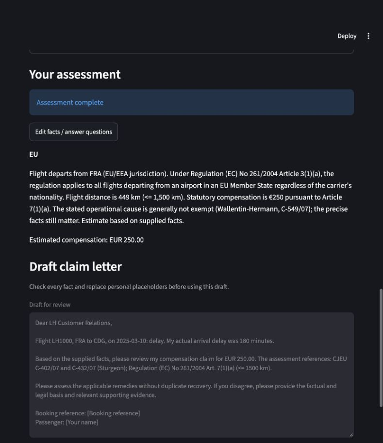

# Phase 6 — browser verification

The running Streamlit interface at http://127.0.0.1:8501 was tested against the
running FastAPI service, with no mocks. Its opening banner displayed:

> Delay model: REAL BTS DATA — trained on a historical US domestic sample.
> Uncalibrated estimates, not a live flight forecast.

Submitted through the form: LH / LH1000, FRA → CDG, March 10, 2025, delay,
180 minutes actual final-arrival delay, airline reason “Technical fault”.
Both prediction options were off; the draft option was on. Other facts were blank.

Observed: “Assessment complete”, “Estimated compensation: EUR 250.00”, and a
letter naming LH1000 and the actual 180-minute delay, requesting EUR 250.00.
The same case's full validated facts, reasoning and letter are recorded in
[the live API report](phase6_evaluation.md).

A running Streamlit process initially retained an old client import after code
changes. Restarting Streamlit resolved it. The final screenshot is from the
restarted application; no exception was displayed on the completed assessment.

This is not legal advice.
